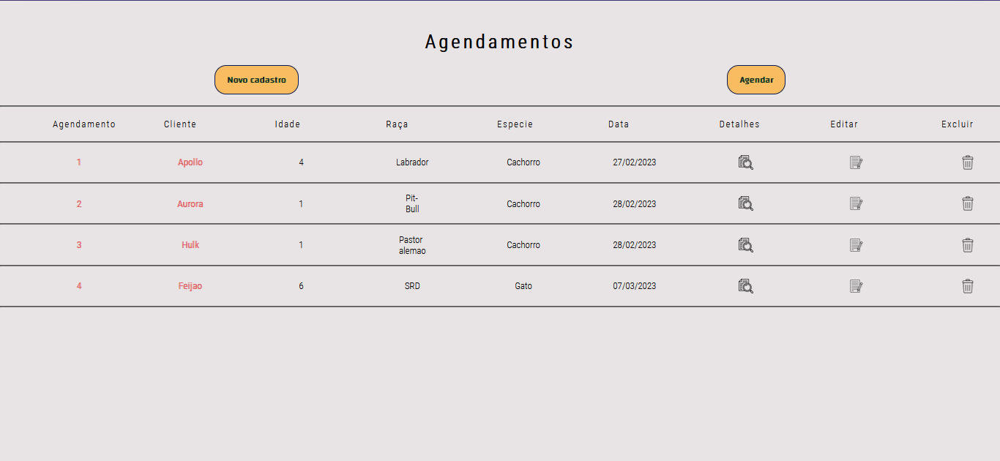
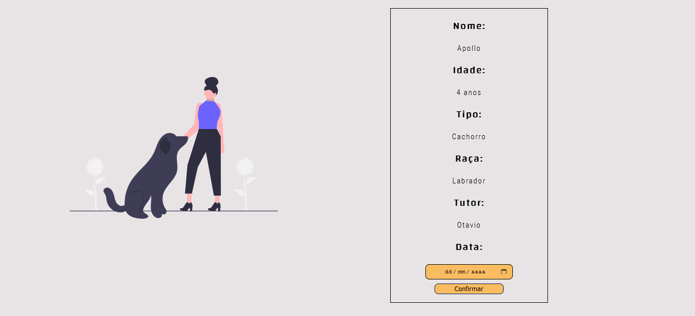
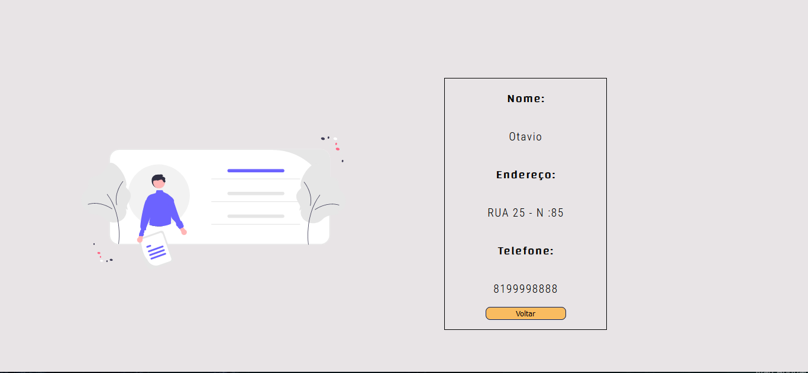

# Case Full-Stack - SoftMaker


Criação de um site de agendamento para um petshop.

## Indice 
 - <a href="#funcionalidades-do-projeto"> Funcionalidades do projeto</a>
 - <a  href="#o-desafio">O desafio</a>
 - <a  href="#layout">Layout</a>
 - <a  href="#demonstração-do-projeto">Demonstração do projeto</a>
 - <a  href="#como-rodar-esse-projeto?">Como rodar esse projeto?</a>
 - <a  href="#tecnologias-utilizadas">Tecnologias utilizadas</a>


## Funcionalidades do Projeto

- [x] Cadastro novos Clientes
- [x] Agendamento para pets
- [x] Listagem de pets
- [x] Detalhes do tutor do pet
- [x] Edição de data de agendamento
- [x] Exclusão de agendamentos


## O desafio
    Você deverá desenvolver um projeto utilizando React no front-end e Node.js no back-end com a finalidade de que seja possível listar, visualizar, criar, editar e excluir animais de estimação de uma petshop.

Observações:

        Você pode utilizar qualquer banco de dados relacional disponível;
        Cada animal de estimação precisa ter um identificador único, nome, idade, tipo (gato ou cachorro) e raça;
        Além dos dados do animal, é necessário também salvar os dados pessoais, de contato e de endereço do seu respectivo dono.


## Layout

Cadastro de novos clientes


Agendamento de pets


Listagem dos agendamentos


Detalhes dos pets agendados


Detalhes dos tutores dos pets


Exclusao de agendamentos


## Demonstração do projeto
[Link Demonstração](http://verdant-boot.surge.sh/)


## Como rodar esse projeto?

``` bash
# Clone esse repositório
$ git clone linkrepo

# Acesse a pasta do projeto no seu computador
$ cd frontEnd

# Instale as dependências
$ npm run start

# A aplicação ira iniciar na porta 3003, acesse pelo navegador
$ http://localhost:3000/
```

## Tecnologias Utilizadas

1. 
 2. 
 3. 
 4. 